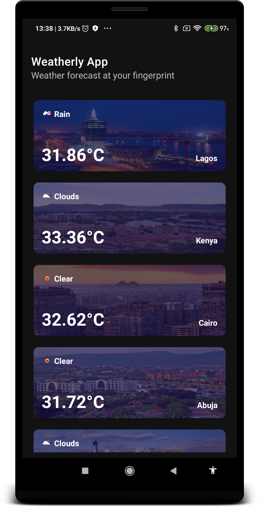
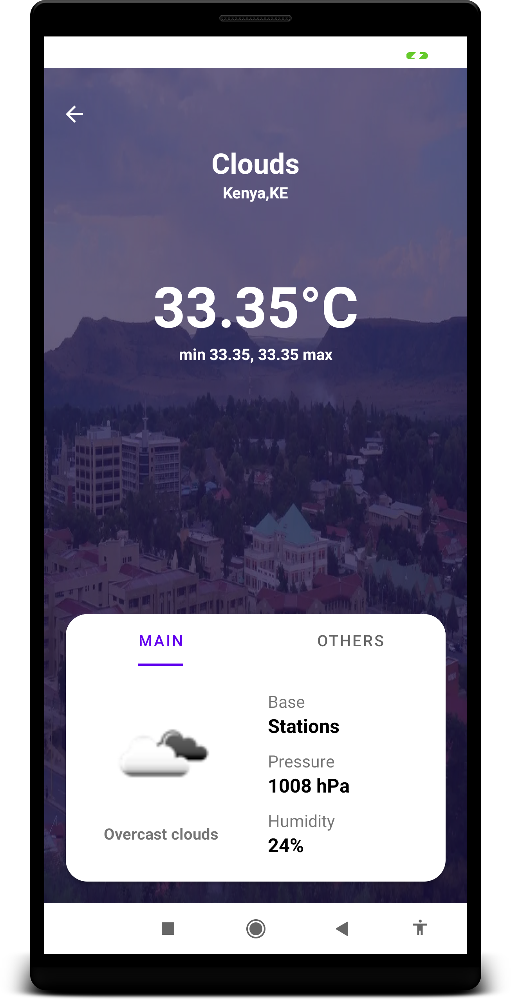

# Weatherly-App
### Screenshots:

  
  

### Note:
Westham is East Sussex. 
Amazon as Amazonas.
  
A two-page mobile weather application detailing the weather information for cities below:

- Kenya
- Lesotho
- Cairo
- Jakarta
- Lagos
- Ankara
- Abuja 
- Kano
- New York
- Peru
- Texas 
- Winnipeg
- Amazon
- Bagdad
- Belarus
- Westham

### Main Architecture:
[MVVM](https://en.wikipedia.org/wiki/Model%E2%80%93view%E2%80%93viewmodel)

### Libraries used:
- Glide to load and display images.
- Gson to deserialize/serialize json data
- Hilt for dependency injections
- Coroutines for asynchronous programming(e.g network calls)
- Retrofit for network calls.
- Mockito to mock objects for unit testing
- Okhttp for intercepting network response/request
- SwipeRefreshLayout used to reload data from the weather api in case there's a failure.

